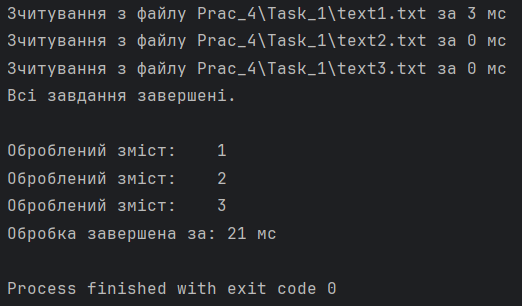

# Варіант №4. Завдання №1

## Умова
Напишіть програму, яка асинхронно завантажуватиме з декількох файлів декілька різних речень тексту (файли підготуйте завчасно). Далі асинхронно видалити усі літери верхнього та нижнього регістрів і залишок записати в один масив.  
Початкові речення та результуючий масив потрібно вивести на екран асинхронно. 
Після виконання кожної асинхронної задачі потрібно виводити на
екран час її виконання.

## Опис

Ця програма демонструє використання класу `CompletableFuture` для асинхронної обробки файлів. Вона зчитує вміст кількох файлів, видаляє всі літери верхнього та нижнього регістрів із тексту, а результати обробки виводить на екран. Програма також використовує пул потоків для виконання задач і виводить час, витрачений на кожну операцію.

## Принцип роботи

Програма виконує такі основні кроки:
1. Створює пул потоків із п'яти потоків за допомогою `Executors.newFixedThreadPool(5)`.
2. Використовує клас `CompletableFuture` для асинхронного виконання завдань:
    - **`supplyAsync`**: Використовується для зчитування вмісту файлів у асинхронному режимі. Кожен файл зчитується методом `readFile`, результати збираються у список.
    - **`thenApplyAsync`**: Асинхронно обробляє вміст файлів, видаляючи всі літери (верхнього і нижнього регістрів) за допомогою регулярного виразу.
    - **`thenAcceptAsync`**: Виводить оброблений вміст кожного файлу та час, витрачений на всі операції.
    - **`thenRunAsync`**: Виводить повідомлення про завершення всіх задач.

3. Завершує роботу пулу потоків за допомогою `executor.shutdown()`.

## Використані методи CompletableFuture

### `supplyAsync(Supplier<U> supplier, Executor executor)`
- Використовується для виконання асинхронного завдання, яке повертає результат.
- У цій програмі: використовується для зчитування файлів у асинхронному режимі.

### `thenApplyAsync(Function<U, V> fn, Executor executor)`
- Використовується для обробки результату попереднього асинхронного завдання.
- У цій програмі: видаляє всі літери з тексту, отриманого з файлів.

### `thenAcceptAsync(Consumer<U> action, Executor executor)`
- Виконує завдання після завершення попереднього та приймає результат для подальшої дії без повернення значення.
- У цій програмі: виводить оброблений текст та час виконання на екран.

### `thenRunAsync(Runnable action, Executor executor)`
- Виконує завдання після завершення попереднього, але не отримує жодного результату від нього.
- У цій програмі: виводить повідомлення "Всі завдання завершені."

## Вивід програми
