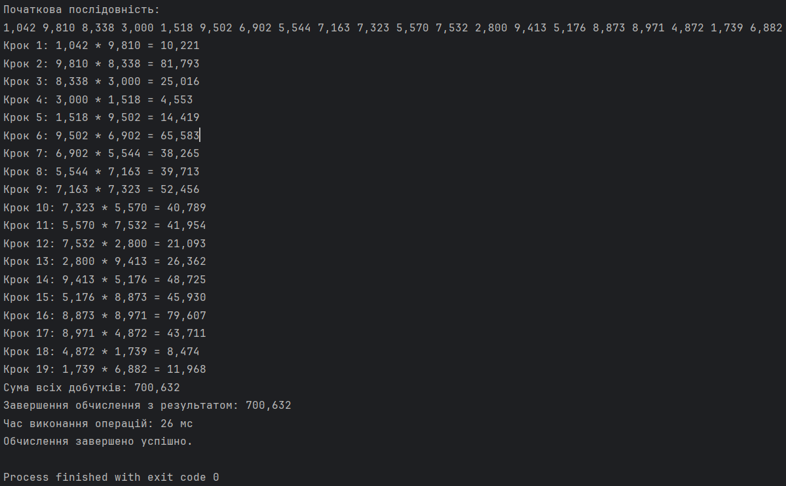

# Варіант №4. Завдання №2

## Умова
Напишіть програму, в якій асинхронно виконайте усі необхідні дії.
Ввести послідовність дійсних чисел (a1, a2, a3, ... an) та обчислити a1 ∗ a2 + a2 ∗ a3 + ⋯ + an−1 ∗ an. Початкову послідовність генерувати рандомно, кількість елементів = 20. 
Початкову послідовність та результат вивести на екран. 
До кожного виводу додавати відповідне інформаційне повідомлення. 
В кінці вивести час роботи усіх асинхронних операцій.

## Опис

Ця програма демонструє використання класу `CompletableFuture` для асинхронного виконання математичних обчислень. Вона генерує масив випадкових дійсних чисел, обчислює добутки кожної пари сусідніх чисел, а також обчислює їхню суму. Для забезпечення асинхронності програма використовує пул потоків, а також методи обробки задач класу `CompletableFuture`.

## Принцип роботи

Програма виконує такі основні кроки:
1. Генерує масив випадкових чисел за допомогою методу `generateRandomSequence`.
2. Використовує пул потоків (`ExecutorService`) із п'яти потоків, створений через `Executors.newFixedThreadPool(5)`.
3. Виконує обчислення за допомогою класу `CompletableFuture`:
    - **`supplyAsync`**: Використовується для обчислення добутків сусідніх чисел у масиві та обчислення їхньої суми.
    - **`thenApplyAsync`**: Асинхронно обробляє результат, виводячи суму всіх добутків.
    - **`thenAcceptAsync`**: Виводить повідомлення про завершення обчислень із підсумковим результатом.
    - **`thenRunAsync`**: Обчислює та виводить загальний час виконання операцій.
    - **`exceptionally`**: Обробляє можливі помилки, які можуть виникнути під час виконання задач.
4. Закриває пул потоків після завершення виконання задач за допомогою `executor.shutdown()`.

## Використані методи `CompletableFuture`

### `supplyAsync(Supplier<U> supplier, Executor executor)`
- Використовується для виконання асинхронного завдання, яке повертає результат.
- У цій програмі: виконує обчислення добутків сусідніх чисел у масиві.

### `thenApplyAsync(Function<U, V> fn, Executor executor)`
- Використовується для обробки результату попереднього асинхронного завдання.
- У цій програмі: обчислює суму всіх добутків.

### `thenAcceptAsync(Consumer<U> action, Executor executor)`
- Виконує дію після завершення попереднього завдання, приймаючи результат як вхідні дані.
- У цій програмі: виводить підсумковий результат.

### `thenRunAsync(Runnable action, Executor executor)`
- Виконує дію після завершення попереднього завдання без отримання вхідних даних.
- У цій програмі: виводить повідомлення про завершення обчислень і час виконання.

### `exceptionally(Function<Throwable, U> fn)`
- Використовується для обробки помилок, які можуть виникнути під час виконання асинхронного завдання.
- У цій програмі: виводить повідомлення про помилку, якщо така виникла.

## Вивід програми

