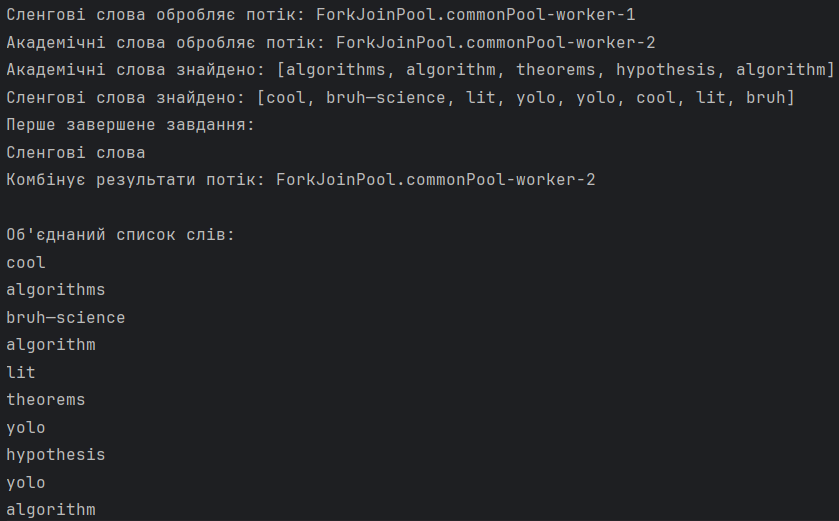
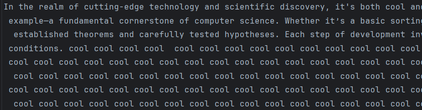
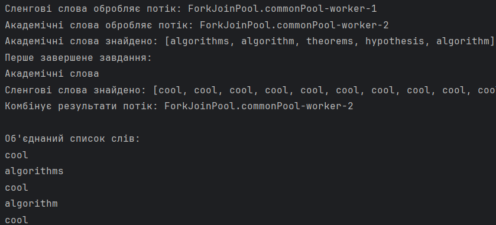

# Варіант №4. Завдання 1

## Умова
Створіть два асинхронних завдання, які виконуються паралельно. Коли обидва завдання завершаться, їх результати повинні бути об’єднані.

## Загальний опис
Ця програма здійснює обробку тексту, що зчитується з файлу, для пошуку сленгових та академічних слів, а також комбінує результати паралельно виконуваних завдань. Для демонстрації багатопотоковості та асинхронного виконання задач використовуються методи класу `CompletableFuture`.

## Основні етапи роботи

1. Читання тексту з файлу.
2. Пошук сленгових слів у тексті.
3. Пошук академічних слів у тексті.
4. Паралельне виконання цих завдань з використанням `CompletableFuture`.
5. Комбінування результатів в порядку "1 сленгове 1 академічне" і виведення їх на екран.

## Методи

### `CompletableFuture.supplyAsync()`

Цей метод використовується для асинхронного запуску завдання у фоновому потоці. У програмі він застосовується для:
- Пошуку сленгових слів у тексті.
- Пошуку академічних слів у тексті.
  Програма створює два окремі завдання для цих операцій, що виконуються паралельно.

### `CompletableFuture.anyOf()`

Цей метод дозволяє продовжити виконання програми після того, як одне з паралельних завдань завершиться. Відмінність від `allOf()` полягає в тому, що тут не потрібно чекати на завершення всіх завдань, достатньо лише одного. У моєму коді після того, як одне із завдань (пошук сленгових або академічних слів) завершується, програма продовжує роботу.

### `CompletableFuture.thenRun()`

Цей метод дозволяє додати додаткову задачу, яка виконується після завершення попередньої. У моєму випадку я використовую його для того, щоб вивести повідомлення, яке завдання завершилося першим.

### `CompletableFuture.thenCompose()`

Цей метод дозволяє з'єднати два асинхронні завдання, так що одне з них виконується після завершення першого. У моєму коді він комбінує результати пошуку сленгових та академічних слів в одну спільну колекцію.

### `CompletableFuture.thenAccept()`

Цей метод дозволяє обробити результат виконання асинхронного завдання після його завершення. Я використовую його для виведення комбінованого списку слів.

### `CompletableFuture.get()`

Цей метод блокує потік і чекає, поки асинхронні завдання не буде завершено. Я використовую його для очікування завершення всіх завдань перед виходом з програми, інакше головний потік завершить роботу швидше ніж завдання зможуть обробити текст.

## Приклади виводу

### Стандартний вивід

### Демонстрація роботи anyOf()
Для демонстрації роботи `anyOf()` я навантажу одне із завдань для пошуку більше ніж інше, для цього я дещо зміню текст у файлі:

В результаті відбудеться такий вивід:

Якщо порівнювати з оригінальним виводом, то в цьому виводі першим завершилося завдання на пошук академічних слів, але через `anyOf()` воно все ще очікувало на завершення пошуку сленгових слів.
