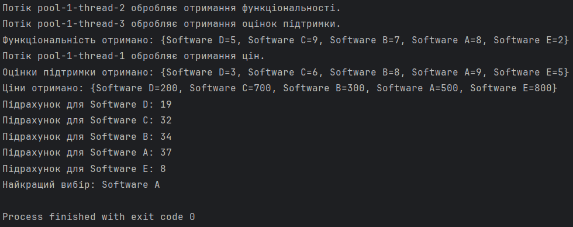

# Варіант №4. Завдання 2

## Умова
Користувач обирає програмне забезпечення для певної задачі. Є кілька варіантів, і потрібно порівняти їх за наступними критеріями: ціна, функціональність і підтримка. Потрібно паралельно отримати ці дані і вибрати найкращий варіант.

## Загальний опис
Ця програма вибирає найкраще програмне забезпечення (ПЗ) на основі трьох критерієв: ціна, функціональність і підтримка. Дані для кожного з цих критеріїв отримуються паралельно за допомогою асинхронних завдань. Для вибору найкращого ПЗ використовується комбінована оцінка на основі отриманих даних.

## Основні методи

- `main(String[] args)` -- Головний метод, який ініціалізує вибір найкращого ПЗ через метод `selectBestSoftware()`
- `selectBestSoftware()` -- Створює пул потоків й ініціює асинхронні завдання для отримання цін, функціональності та підтримки. Після завершення всіх завдань комбінує отримані дані і обчислює найкраще ПЗ.
- `getPrices()`, `getFunctionalities()`, `getSupportScores()` -- Методи для симуляції отримання даних про ціни, функціональність і підтримку для кожного ПЗ. Кожен з цих методів виконується асинхронно в окремому потоці.
- `selectBestOption(Map<String, Integer> prices, Map<String, Integer> functionalities, Map<String, Integer> supportScores)` -- Визначає найкраще ПЗ, обчислюючи загальний бал на основі отриманих даних.
- `calculateScore(int price, int functionality, int support)` -- Обчислює бал для кожного ПЗ за допомогою формули: висока функціональність і підтримка, низька ціна.
- `simulateDelay()` -- Метод, який симулює затримку для кожного асинхронного завдання.

## Асинхронні завдання CompletableFuture

### `CompletableFuture.supplyAsync()`

Для кожного критерію (ціна, функціональність, підтримка) використовуються окремі асинхронні завдання для отримання відповідних даних. Це дає можливість виконувати ці завдання паралельно.

### `CompletableFuture.allOf()`

Використовується для запуску всіх завдань паралельно і чекає завершення всіх асинхронних завдань перед обробкою результатів. Головний потік чекає завершення всіх завдань за допомогою методу `join()`.

### `thenRun()`

Після завершення всіх завдань виконуються подальші операції, зокрема комбінування результатів і вибір найкращого ПЗ.

### `get()`

Викликається для кожного асинхронного завдання, щоб отримати результат після його завершення.

## Формула розрахунку балу для ПЗ

**Оцінка = (Функціональність * 3) + (Підтримка * 2) - (Ціна / 100)**

## Приклад виводу

