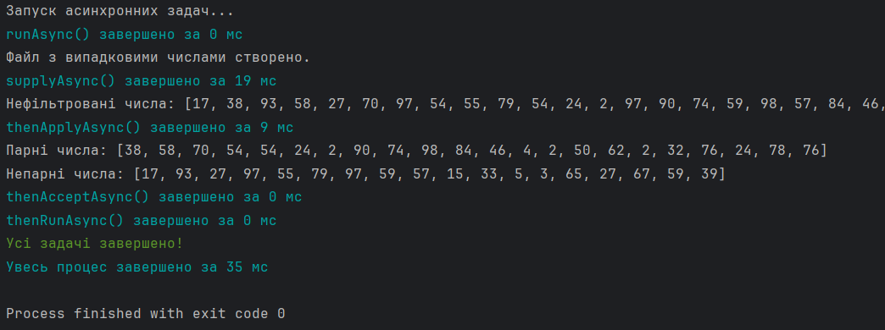

# CompletableFuture Example: Асинхронне оброблення чисел з використанням Java

## Опис

Ця програма демонструє використання класу `CompletableFuture` для асинхронного виконання різних задач у Java. У програмі генерується текстовий файл, який містить випадкові числа. Потім ці числа зчитуються, фільтруються за умовою (парні та непарні), і результати виводяться на екран. Для кожної асинхронної операції (створення файлу, зчитування, фільтрація) вимірюється час виконання.

Програма використовує п'ять основних методів класу `CompletableFuture`:
1. `runAsync()`
2. `supplyAsync()`
3. `thenApplyAsync()`
4. `thenAcceptAsync()`
5. `thenRunAsync()`

Ці методи дозволяють виконувати асинхронні задачі, передавати дані між ними та виконувати додаткові дії після завершення задач.

## Теоретичний опис

### 1. **CompletableFuture**
- `CompletableFuture` — це клас в Java, який представляє асинхронне обчислення. Його можна використовувати для виконання задач у фоновому режимі без блокування основного потоку програми.
- `CompletableFuture` надає методи для комбінування асинхронних задач, таких як `thenApplyAsync()`, `thenAcceptAsync()`, `thenRunAsync()`, які дозволяють виконувати додаткові операції після завершення попередніх.

### 2. **Методи `CompletableFuture`**

- **`runAsync()`**
    - Використовується для виконання задачі у фоновому потоці без повернення результату.
    - У даному прикладі використовуваний для повідомлення про початок асинхронних операцій.

- **`supplyAsync()`**
    - Виконує задачу в фоновому потоці і повертає результат.
    - Використовується для створення файлу з випадковими числами.

- **`thenApplyAsync()`**
    - Приймає результат попередньої асинхронної задачі та застосовує до нього трансформацію (наприклад, фільтрацію).
    - У прикладі зчитує числа з файлу і фільтрує їх на парні та непарні.

- **`thenAcceptAsync()`**
    - Використовується для виконання операцій після того, як результат попередньої задачі вже доступний. Зазвичай використовується для виведення результатів.
    - У моєму випадку виводить на екран парні та непарні числа.

- **`thenRunAsync()`**
    - Використовується для виконання операцій після завершення всіх попередніх задач, але не потребує результату.
    - У даному прикладі виводить повідомлення про завершення всіх задач.

### 3. **Вимірювання часу**
- Програма вимірює час виконання кожної асинхронної операції за допомогою `System.nanoTime()`.
- Час виконання вимірюється у мілісекундах та виводиться після завершення кожного етапу.
- Також вимірюється загальний час виконання всього процесу від початку до кінця.

### 4. **Фільтрація парних і непарних чисел**
- У програмі використовується два різних фільтри для чисел: один для парних (`n % 2 == 0`), інший для непарних (`n % 2 != 0`).
- Ці фільтри виконуються паралельно на основі вхідних даних, а результати виводяться окремо для кожного типу чисел.

### Приклад виводу:

## Висновки

- **`CompletableFuture`** дозволяє зручно працювати з асинхронними задачами в Java, використовуючи методи ланцюжків для поетапної обробки результатів.
- Всі асинхронні задачі виконуються паралельно, і кожен етап завершується за час, який вимірюється та виводиться на екран.
- Програма демонструє основні функціональні можливості класу `CompletableFuture`, такі як асинхронне виконання, обробка результатів та передача даних між задачами.